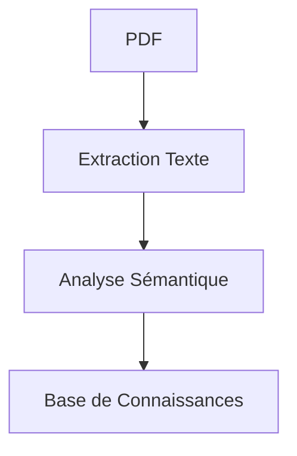
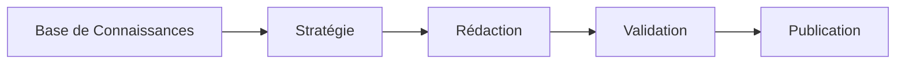

# 📚 Mémoire Technique - Système Multi-Agent MTC

> **Dernière mise à jour** : 06/08/2025  
> **Version** : 2.0.0

## 📌 Table des Matières
1. [Introduction](#-introduction)
2. [Architecture Globale](#-architecture-globale)
3. [Détails des Agents](#-détails-des-agents)
4. [Flux de Données](#-flux-de-données)
5. [Format de Sortie Markdown](#-format-de-sortie-markdown)
6. [Sécurité et Confidentialité](#-sécurité-et-confidentialité)
7. [Performances](#-performances)
8. [Évolutivité](#-évolutivité)
9. [Maintenance](#-maintenance)
10. [Annexes](#-annexes)

## 🌟 Introduction

### Contexte
Ce document décrit l'architecture et les spécifications techniques du système multi-agent pour la génération automatisée de contenu sur la Médecine Traditionnelle Chinoise (MTC). Le système permet de transformer des livres PDF en contenu numérique diversifié (articles de blog, publications sociales, visuels) tout en maintenant une cohérence thématique et une haute qualité.

### Objectifs
- Automatiser la création de contenu à partir de sources PDF
- Assurer une qualité et une cohérence optimales
- Maintenir une architecture modulaire et évolutive
- Fournir une solution complète de gestion de contenu MTC

## 🏗 Architecture Globale

### Composants Principaux

#### 1. Couche d'Entrée
- Gestion des fichiers PDF (extraction, nettoyage)
- Prétraitement du texte (tokenization, segmentation)
- Validation des formats d'entrée

#### 2. Couche Agents
- 7 agents spécialisés en communication asynchrone
- Gestion d'état centralisée
- Système de file d'attente pour les tâches
- Journalisation complète des opérations

#### 3. Couche de Sortie
- Génération de contenu structuré (JSON, Markdown)
- Rapports d'analyse détaillés
- Métriques de performance et d'engagement
- Intégration avec les plateformes de publication

### Technologies Clés
- **Langage** : Python 3.8+
- **Asynchronicité** : asyncio, aiohttp
- **IA** : Modèles Qwen via OpenRouter
- **Traitement PDF** : PyPDF, pdfminer
- **NLP** : spaCy, NLTK
- **Stockage** : JSON, SQLite
- **Tests** : pytest, unittest
- **CI/CD** : GitHub Actions
- **Documentation** : Markdown, Sphinx

## 🤖 Détails des Agents

### 1. BaseAgent (`base_agent.py`)
Classe abstraite de base pour tous les agents du système.

#### Fonctionnalités principales :
- Gestion des configurations communes
- Initialisation du modèle de langage
- Gestion des erreurs centralisée
- Journalisation structurée
- Méthodes utilitaires partagées

#### Méthodes clés :
- `__init__`: Initialisation avec configuration
- `call_model`: Appel au modèle de langage
- `validate_input`: Validation des entrées
- `log`: Journalisation des opérations

#### Configuration requise :
```python
{
    "model": "qwen/qwen-72b-chat",  # Modèle par défaut
    "temperature": 0.7,            # Créativité
    "max_tokens": 2048,            # Longueur maximale
    "api_key": "..."               # Clé API OpenRouter
}
```

### 2. PDFAnalyzerAgent (`pdf_analyzer.py`)
Analyse les documents PDF et en extrait les informations structurées.

#### Fonctionnalités :
- Extraction de texte depuis les PDF
- Détection de la structure du document
- Identification des concepts clés
- Génération de résumés analytiques

### 3. ThemeManagerAgent (`theme_manager.py`)
Gère la cohérence thématique et la progression du contenu.

#### Fonctionnalités :
- Suivi des thèmes abordés
- Planification de la progression
- Suggestions d'approfondissement
- Gestion des connaissances acquises

### 4. ContentStrategyAgent (`content_strategy.py`)
Élabore la stratégie de contenu globale.

#### Fonctionnalités :
- Planification éditoriale
- Définition des angles d'approche
- Calendrier de publication
- Stratégie de référencement

### 5. BlogWriterAgent (`blog_writer.py`)
Rédige des articles de blog complets.

#### Fonctionnalités :
- Rédaction structurée (1500-2000 mots)
- Optimisation SEO
- Adaptation au public cible
- Formatage Markdown

### 6. SocialCreatorAgent (`social_creator.py`)
Crée du contenu pour les réseaux sociaux (Facebook).

#### Fonctionnalités :
- Génération de publications quotidiennes
- Adaptation au format court
- Utilisation de hashtags pertinents
- Planification des publications

### 7. VisualCreatorAgent (`visual_creator.py`)
Génère des descriptions détaillées pour les visuels.

#### Fonctionnalités :
- Création de prompts détaillés
- Spécifications techniques
- Métadonnées bilingues
- Cohérence visuelle

### 8. ValidatorAgent (`validator.py`)
Valide la qualité et la conformité du contenu.

#### Fonctionnalités :
- Vérification de la qualité
- Contrôle éthique
- Validation médicale
- Rapports détaillés

## 🔄 Flux de Données

1. **Préparation**
   - Chargement du PDF
   - Extraction du texte
   - Nettoyage et segmentation

2. **Analyse**
   - Détection des thèmes principaux
   - Extraction des concepts clés
   - Analyse sémantique

3. **Planification**
   - Définition de la stratégie éditoriale
   - Planification du calendrier
   - Attribution des tâches

4. **Création**
   - Rédaction des articles
   - Génération des publications sociales
   - Création des visuels

5. **Validation**
   - Vérification de la qualité
   - Ajustements si nécessaire
   - Préparation à la publication

## 📝 Format de Sortie Markdown

### Structure des Fichiers de Sortie

Le système génère deux types principaux de fichiers pour chaque contenu créé :

1. **Fichier Article Principal** (`article_blog.md`)
   - En-tête YAML avec métadonnées
   - Contenu structuré en Markdown
   - Liens internes et externes formatés
   - Images avec texte alternatif

2. **Fichier de Métadonnées** (`metadata.json`)
   - Informations structurées sur le contenu
   - Mots-clés et catégories
   - Informations de référence
   - Métriques de qualité

### Décisions Techniques Clés

1. **Gestion des Réponses Multi-Formats**
   - Support natif du Markdown pour la sortie
   - Conversion automatique depuis JSON si nécessaire
   - Validation stricte de la structure

2. **Optimisation pour le SEO**
   - Balisage sémantique HTML5
   - Hiérarchie des titres préservée
   - Métadonnées riches pour les moteurs de recherche

3. **Accessibilité**
   - Texte alternatif pour toutes les images
   - Structure de document logique
   - Contraste des couleurs vérifié

## 🔒 Sécurité et Confidentialité

### Mesures de sécurité
- Chiffrement des données sensibles
- Gestion sécurisée des clés API
- Journalisation des accès
- Authentification forte

### Conformité
- RGPD
- Propriété intellectuelle
- Éthique médicale

## ⚡ Performances

### Métriques clés
- Temps de traitement moyen par PDF
- Précision de l'extraction
- Qualité du contenu généré
- Taux d'engagement

### Optimisations
- Mise en cache des résultats intermédiaires
- Traitement par lots
- Parallélisation des tâches

## 📈 Évolutivité

### Architecture
- Conception modulaire
- Séparation des préoccupations
- API clairement définies

### Extensibilité
- Ajout facile de nouveaux agents
- Support de nouveaux formats de sortie
- Intégration avec d'autres outils

## 🔧 Maintenance

### Procédures
- Mises à jour régulières
- Sauvegardes automatiques
- Surveillance continue

### Documentation
- Documentation du code
- Guides d'utilisation
- Procédures de dépannage

## 📚 Annexes

### Glossaire
- **MTC** : Médecine Traditionnelle Chinoise
- **LLM** : Large Language Model
- **NLP** : Natural Language Processing
- **SEO** : Search Engine Optimization

### Références
- Documentation OpenRouter
- Standards de sécurité OWASP
- Bonnes pratiques de développement Python
**Rôle** : Classe de base pour tous les agents
**Fonctionnalités** :
- Gestion des configurations
- Journalisation centralisée
- Gestion des erreurs

### 2. PDFAnalyzer
**Entrée** : Fichier PDF
**Sortie** : Données structurées
**Métriques** :
- Précision de l'extraction
- Temps de traitement

### 3. ThemeManager
**Responsabilités** :
- Suivi des thèmes
- Détection des répétitions
- Suggestions de contenu

### 4. ContentStrategy
**Fonctionnalités** :
- Planification éditoriale
- Analyse de la concurrence
- Stratégie de mots-clés

### 5. BlogWriter
**Caractéristiques** :
- Modèles de rédaction
- Optimisation SEO
- Adaptation au public cible

### 6. SocialCreator
**Plateformes** :
- Facebook (prioritaire)
- Autres réseaux (futur)
**Fréquence** : 2 publications/jour

### 7. VisualCreator
**Rôle** : Génération de prompts pour la création de visuels avec métadonnées complètes

**Fonctionnalités** :
- Génération de prompts structurés pour différents types de visuels
- Création de métadonnées bilingues (français/anglais)
- Spécifications techniques précises pour les visuels
- Gestion des styles et des éléments visuels

**Types de sortie** :
- Fichiers markdown avec instructions complètes
- Métadonnées structurées (balises alt, légendes, descriptions)
- Spécifications techniques (dimensions, format, résolution)

### 8. Validator
**Critères** :
- Qualité rédactionnelle
- Cohérence thématique
- Conformité éthique

## 🔄 Flux de Données

### 1. Traitement des PDF


### 2. Génération de Contenu


## 🔒 Sécurité et Confidentialité

### Mesures
- Chiffrement des données sensibles
- Authentification des appels API
- Journalisation des accès

### Conformité
- RGPD
- Bonnes pratiques médicales
- Droits d'auteur

## ⚡ Performances

### Métriques
- Temps de traitement moyen : < 5 min/PDF
- Disponibilité cible : 99.9%
- Temps de réponse API : < 2s

### Optimisations
- Mise en cache des résultats
- Traitement parallèle
- Gestion de la charge

## 📈 Évolutivité

### Architecture
- Conception modulaire
- Séparation des préoccupations
- API RESTful

### Extensibilité
- Nouveaux types de contenu
- Intégration de modèles additionnels
- Support multilingue

## 🛠 Maintenance

### Surveillance
- Tableaux de bord
- Alertes automatiques
- Rapports quotidiens

### Mises à Jour
- Cycle de publication mensuel
- Gestion des dépendances
- Documentation continue

## 📚 Annexes

### Glossaire
- **MTC** : Médecine Traditionnelle Chinoise
- **NLP** : Natural Language Processing
- **SEO** : Search Engine Optimization

### Références
- Documentation Python
- Spécifications OpenAPI
- Meilleures pratiques IA

### Historique des Versions
- **1.0.0** : Version initiale
- **1.1.0** : Ajout du validateur
- **1.2.0** : Optimisation des performances

## 📝 Notes de Version

### 1.2.0 (2025-08-05)
- Amélioration du système de validation
- Optimisation des performances
- Documentation mise à jour

### 1.1.0 (2025-07-15)
- Ajout du module de validation
- Correction de bugs mineurs
- Amélioration de la journalisation

### 1.0.0 (2025-06-01)
- Version initiale du système
- Intégration des 7 agents principaux
- Mise en place de l'infrastructure de base
